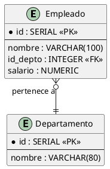
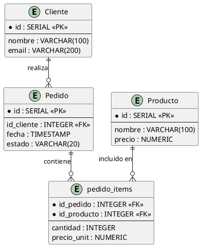
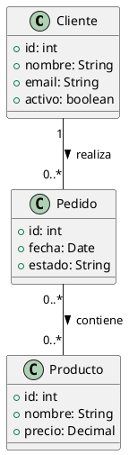
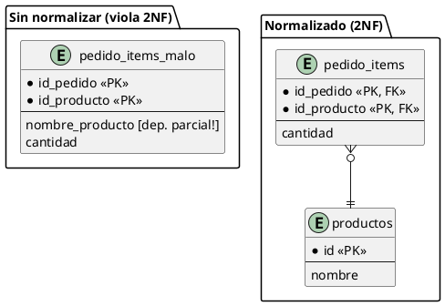
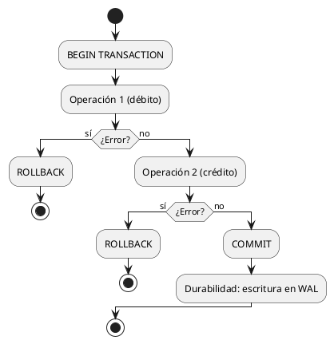
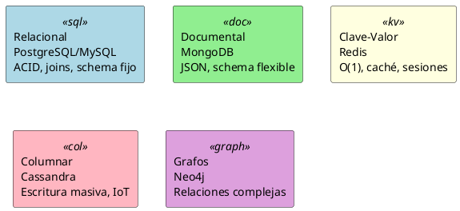
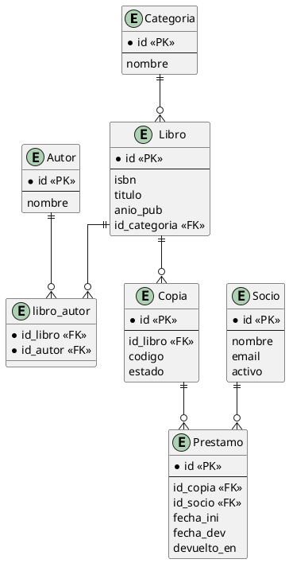

# ApuntesBaseDeDatos — Implementation Plan

> **For agentic workers:** REQUIRED SUB-SKILL: Use superpowers:subagent-driven-development (recommended) or superpowers:executing-plans to implement this plan task-by-task. Steps use checkbox (`- [ ]`) syntax for tracking.

**Goal:** Scaffold completo de cuaderno LaTeX de apuntes DBA que compila a PDF desde día 1, con stubs estructurados en los 14 capítulos.

**Architecture:** Documento LaTeX modular — `preamble.tex` centraliza paquetes y estilos tcolorbox, `main.tex` ensambla capítulos via `\input`, cada capítulo en su propio `.tex`. PlantUML genera PNGs antes de la compilación vía Makefile.

**Tech Stack:** pdflatex, tcolorbox, listings (SQL highlighting), PlantUML + Java, GNU Make

---

### Task 1: Estructura de directorios y .gitignore

**Files:**
- Create: `.gitignore`
- Create: `images/diagrams/.gitkeep`
- Create: `images/src_plantuml/.gitkeep`
- Create: `chapters/.gitkeep` (temporal, se borra al agregar .tex)

- [ ] **Step 1: Inicializar git y crear directorios**

```powershell
cd "C:\Users\aldo-\OneDrive\Documentos\CodigoAbierto\Apuntes\DBA"
git init
git branch -M main
New-Item -ItemType Directory -Force images/diagrams
New-Item -ItemType Directory -Force images/src_plantuml
New-Item -ItemType Directory -Force chapters
New-Item -ItemType File -Force images/diagrams/.gitkeep
New-Item -ItemType File -Force images/src_plantuml/.gitkeep
```

- [ ] **Step 2: Crear .gitignore**

Contenido de `.gitignore`:
```
# LaTeX compilados
*.aux
*.log
*.toc
*.out
*.fls
*.fdb_latexmk
*.synctex.gz
main.pdf

# Imágenes generadas (se regeneran con make)
images/diagrams/*.png

# PlantUML jar (usuario lo descarga)
*.jar
```

- [ ] **Step 3: Commit**

```bash
git add .gitignore images/ chapters/
git commit -m "chore: estructura inicial de directorios"
```

---

### Task 2: preamble.tex

**Files:**
- Create: `preamble.tex`

- [ ] **Step 1: Escribir preamble.tex**

```latex
% preamble.tex
\usepackage[utf8]{inputenc}
\usepackage[T1]{fontenc}
\usepackage[spanish]{babel}
\usepackage[a4paper, top=2.5cm, bottom=2.5cm, left=3cm, right=2.5cm]{geometry}
\usepackage{fancyhdr}
\usepackage{hyperref}
\usepackage{xcolor}
\usepackage{listings}
\usepackage{tcolorbox}
\usepackage{tikz}
\usepackage{graphicx}
\usepackage{booktabs}
\usepackage{enumitem}
\usepackage{parskip}

\tcbuselibrary{skins, breakable, listings}

% ─── Colores ───────────────────────────────────────────────────────────────────
\definecolor{azulclaro}{RGB}{219, 234, 254}
\definecolor{azuloscu}{RGB}{30, 64, 175}
\definecolor{grisclaro}{RGB}{243, 244, 246}
\definecolor{grisoscu}{RGB}{55, 65, 81}
\definecolor{verdeclaro}{RGB}{209, 250, 229}
\definecolor{verdeoscu}{RGB}{6, 95, 70}
\definecolor{naranjaclar}{RGB}{255, 237, 213}
\definecolor{naranjaoscu}{RGB}{154, 52, 18}
\definecolor{rojoclaro}{RGB}{254, 226, 226}
\definecolor{rojooscu}{RGB}{153, 27, 27}
\definecolor{amarilloclaro}{RGB}{254, 249, 195}
\definecolor{amarillooscu}{RGB}{113, 63, 18}
\definecolor{sqlkeyword}{RGB}{37, 99, 235}
\definecolor{sqlcomment}{RGB}{107, 114, 128}
\definecolor{sqlstring}{RGB}{22, 163, 74}

% ─── Listings SQL ──────────────────────────────────────────────────────────────
\lstdefinestyle{sql}{
  language=SQL,
  basicstyle=\ttfamily\small,
  keywordstyle=\color{sqlkeyword}\bfseries,
  commentstyle=\color{sqlcomment}\itshape,
  stringstyle=\color{sqlstring},
  showstringspaces=false,
  breaklines=true,
  frame=single,
  framerule=0.5pt,
  rulecolor=\color{grisoscu},
  backgroundcolor=\color{grisclaro},
  numbers=left,
  numberstyle=\tiny\color{sqlcomment},
  numbersep=8pt,
  tabsize=2,
  morekeywords={SERIAL, RETURNING, EXPLAIN, ANALYZE, VACUUM, CONCURRENTLY,
                JSONB, GIN, GIST, ILIKE, SIMILAR, LATERAL, WITHIN, FILTER,
                OVER, PARTITION, ROWS, RANGE, PRECEDING, FOLLOWING,
                UNBOUNDED, CURRENT, ROW, NULLS, FIRST, LAST,
                MATERIALIZED, RECURSIVE, INCLUDE, EXCLUDE},
}
\lstset{style=sql}

% ─── tcolorbox styles ──────────────────────────────────────────────────────────
\newtcolorbox{teoriabox}[1]{
  colback=azulclaro,
  colframe=azuloscu,
  fonttitle=\bfseries,
  title={[Teoria] #1},
  breakable,
  before upper={\parskip=4pt}
}

\newtcolorbox{diagramabox}[1]{
  colback=verdeclaro,
  colframe=verdeoscu,
  fonttitle=\bfseries,
  title={[Diagrama] #1},
  breakable
}

\newtcolorbox{entrevistabox}{
  colback=naranjaclar,
  colframe=naranjaoscu,
  fonttitle=\bfseries,
  title={[Entrevista] Preguntas tipicas},
  breakable,
  before upper={\parskip=4pt}
}

\newtcolorbox{warningbox}[1]{
  colback=rojoclaro,
  colframe=rojooscu,
  fonttitle=\bfseries,
  title={[Advertencia] #1},
  breakable
}

\newtcolorbox{tipbox}[1]{
  colback=amarilloclaro,
  colframe=amarillooscu,
  fonttitle=\bfseries,
  title={[Tip] #1},
  breakable
}

% ─── Encabezados/pies ──────────────────────────────────────────────────────────
\pagestyle{fancy}
\fancyhf{}
\fancyhead[LE,RO]{\thepage}
\fancyhead[LO]{\nouppercase{\rightmark}}
\fancyhead[RE]{\nouppercase{\leftmark}}
\renewcommand{\headrulewidth}{0.4pt}

% ─── Hyperref ──────────────────────────────────────────────────────────────────
\hypersetup{
  colorlinks=true,
  linkcolor=azuloscu,
  urlcolor=verdeoscu,
  citecolor=grisoscu,
  pdftitle={Apuntes DBA},
  pdfauthor={Aldo Zetina Muci\~no},
}
```

- [ ] **Step 2: Commit**

```bash
git add preamble.tex
git commit -m "feat: preamble con estilos tcolorbox y listings SQL"
```

---

### Task 3: main.tex

**Files:**
- Create: `main.tex`

- [ ] **Step 1: Escribir main.tex**

```latex
\documentclass[12pt, a4paper, openany]{book}
\input{preamble}

\begin{document}

% ─── Portada ───────────────────────────────────────────────────────────────────
\begin{titlepage}
  \centering
  \vspace*{3cm}
  {\Huge\bfseries Apuntes DBA\par}
  \vspace{1em}
  {\Large Bases de Datos para Entrevistas y Uso Profesional\par}
  \vspace{3cm}
  {\large\bfseries Aldo Zetina Muci\~no\par}
  \vspace{0.5em}
  {\normalsize zetinaa3@gmail.com\par}
  \vfill
  {\normalsize \today\par}
\end{titlepage}

% ─── Tabla de contenidos ───────────────────────────────────────────────────────
\tableofcontents
\newpage

% ─── Capítulos ─────────────────────────────────────────────────────────────────
\input{chapters/00_intro}
\input{chapters/01_modelo_relacional}
\input{chapters/02_sql_fundamentos}
\input{chapters/03_sql_avanzado}
\input{chapters/04_modelado_uml}
\input{chapters/05_normalizacion}
\input{chapters/06_indices}
\input{chapters/07_transacciones}
\input{chapters/08_postgresql}
\input{chapters/09_mysql}
\input{chapters/10_nosql}
\input{chapters/11_diseno_bd}
\input{chapters/12_administracion}
\input{chapters/13_entrevistas}

\end{document}
```

- [ ] **Step 2: Commit**

```bash
git add main.tex
git commit -m "feat: main.tex con portada y estructura de capitulos"
```

---

### Task 4: Makefile

**Files:**
- Create: `Makefile`

- [ ] **Step 1: Escribir Makefile**

```makefile
PUML_JAR  ?= plantuml.jar
PUML_SRC  := images/src_plantuml
PUML_OUT  := images/diagrams
PUML_FILES := $(wildcard $(PUML_SRC)/*.puml)
PNG_FILES  := $(patsubst $(PUML_SRC)/%.puml,$(PUML_OUT)/%.png,$(PUML_FILES))
MAIN      := main

.PHONY: all diagrams clean

all: diagrams $(MAIN).pdf

diagrams: $(PNG_FILES)

$(PUML_OUT)/%.png: $(PUML_SRC)/%.puml
	java -jar $(PUML_JAR) -tpng -o $(CURDIR)/$(PUML_OUT) $<

$(MAIN).pdf: $(MAIN).tex preamble.tex chapters/*.tex
	pdflatex -interaction=nonstopmode $(MAIN).tex
	pdflatex -interaction=nonstopmode $(MAIN).tex

clean:
	rm -f *.aux *.log *.toc *.out *.fls *.fdb_latexmk *.synctex.gz
	rm -f $(MAIN).pdf

cleanall: clean
	rm -f $(PUML_OUT)/*.png
```

- [ ] **Step 2: Commit**

```bash
git add Makefile
git commit -m "feat: Makefile para PlantUML y pdflatex"
```

---

### Task 5: Capítulos 00–06

**Files:**
- Create: `chapters/00_intro.tex`
- Create: `chapters/01_modelo_relacional.tex`
- Create: `chapters/02_sql_fundamentos.tex`
- Create: `chapters/03_sql_avanzado.tex`
- Create: `chapters/04_modelado_uml.tex`
- Create: `chapters/05_normalizacion.tex`
- Create: `chapters/06_indices.tex`

- [ ] **Step 1: chapters/00\_intro.tex**

```latex
\chapter{Introducción a Bases de Datos}

\section{¿Qué es una base de datos?}

Sistema organizado para almacenar, gestionar y recuperar datos de forma persistente. El DBMS administra acceso, integridad y almacenamiento; la aplicación nunca toca los archivos directamente.

\begin{itemize}
  \item \textbf{BD:} colección estructurada de datos relacionados
  \item \textbf{DBMS:} software que controla acceso concurrente, integridad y persistencia
  \item \textbf{RDBMS:} DBMS basado en modelo relacional (PostgreSQL, MySQL, Oracle, SQL Server)
\end{itemize}

\section{Tipos de bases de datos}

\begin{itemize}
  \item \textbf{Relacional (SQL):} tablas con esquema fijo, ACID, joins — PostgreSQL, MySQL
  \item \textbf{Documental:} JSON/BSON sin esquema fijo — MongoDB, CouchDB
  \item \textbf{Clave-valor:} acceso O(1) por clave — Redis, DynamoDB
  \item \textbf{Columnar:} analítica, series de tiempo — Cassandra, ClickHouse
  \item \textbf{Grafos:} relaciones complejas entre entidades — Neo4j
\end{itemize}

\section{DBMS vs archivo plano}

\begin{itemize}
  \item Concurrencia controlada: múltiples usuarios sin corrupción
  \item Integridad referencial automática (FK, constraints)
  \item Recuperación ante fallos (WAL, journaling)
  \item Consultas declarativas en lugar de código imperativo
\end{itemize}

\begin{lstlisting}[caption={DDL + DML básico}]
-- Crear tabla
CREATE TABLE empleados (
    id        SERIAL PRIMARY KEY,
    nombre    VARCHAR(100) NOT NULL,
    depto     VARCHAR(50),
    salario   NUMERIC(10,2) DEFAULT 0
);

-- Insertar
INSERT INTO empleados (nombre, depto, salario)
VALUES ('Ana López', 'Ingeniería', 45000.00);

-- Consultar
SELECT nombre, salario
FROM   empleados
WHERE  depto = 'Ingeniería'
ORDER BY salario DESC;
\end{lstlisting}

\begin{lstlisting}[caption={Tipos de datos comunes}]
-- Numéricos
id      SERIAL          -- entero autoincremental (alias de INTEGER + secuencia)
precio  NUMERIC(10,2)   -- exacto: 10 dígitos, 2 decimales
ratio   FLOAT           -- punto flotante (impreciso para dinero)

-- Texto
nombre  VARCHAR(100)    -- longitud máxima 100
codigo  CHAR(6)         -- longitud fija 6 (rellena con espacios)
notas   TEXT            -- longitud ilimitada

-- Fechas
creado  TIMESTAMP DEFAULT NOW()
fecha   DATE
\end{lstlisting}

\begin{entrevistabox}
\begin{enumerate}
  \item ¿Cuál es la diferencia entre DBMS y RDBMS?
  \item ¿Cuándo elegirías NoSQL sobre SQL? Da un ejemplo concreto.
  \item ¿Qué ventajas ofrece un DBMS frente a archivos planos para una aplicación con múltiples usuarios?
\end{enumerate}
\end{entrevistabox}
```

- [ ] **Step 2: chapters/01\_modelo\_relacional.tex**

```latex
\chapter{Modelo Relacional}

\section{Conceptos fundamentales}

El modelo relacional representa datos como tablas (relaciones). Cada fila es una tupla única; cada columna es un atributo con dominio definido. Las relaciones entre tablas se expresan mediante llaves.

\begin{itemize}
  \item \textbf{Relación:} tabla con nombre único en el esquema
  \item \textbf{Tupla:} fila — instancia de la entidad
  \item \textbf{Atributo:} columna con tipo de dato fijo
  \item \textbf{Dominio:} conjunto de valores válidos para un atributo
  \item \textbf{Grado:} número de atributos (columnas)
  \item \textbf{Cardinalidad:} número de tuplas (filas)
\end{itemize}

\section{Llaves}

\begin{itemize}
  \item \textbf{Superkey:} conjunto de atributos que identifica tuplas únicamente
  \item \textbf{Candidate key:} superkey mínima (sin atributos redundantes)
  \item \textbf{Primary Key (PK):} candidate key elegida; NOT NULL + UNIQUE
  \item \textbf{Foreign Key (FK):} atributo que referencia la PK de otra tabla
  \item \textbf{Surrogate key:} PK artificial (SERIAL/UUID) sin significado de negocio
  \item \textbf{Natural key:} PK con significado de negocio (RFC, email)
\end{itemize}

\section{Integridad referencial}

FK debe apuntar a un valor que existe en la tabla referenciada, o ser NULL si se permite.
Acciones ante DELETE/UPDATE en tabla padre: \texttt{CASCADE}, \texttt{SET NULL}, \texttt{RESTRICT}, \texttt{NO ACTION}.

\begin{lstlisting}[caption={PK, FK e integridad referencial}]
CREATE TABLE departamentos (
    id     SERIAL PRIMARY KEY,
    nombre VARCHAR(80) NOT NULL UNIQUE
);

CREATE TABLE empleados (
    id       SERIAL PRIMARY KEY,
    nombre   VARCHAR(100) NOT NULL,
    id_depto INTEGER REFERENCES departamentos(id)
             ON DELETE SET NULL
             ON UPDATE CASCADE
);

-- FK viola integridad si el depto no existe:
INSERT INTO empleados (nombre, id_depto) VALUES ('Carlos', 999);
-- ERROR: insert or update on table "empleados" violates foreign key constraint
\end{lstlisting}

\begin{lstlisting}[caption={Cardinalidades 1:1, 1:N, M:N}]
-- 1:N — un depto tiene muchos empleados (FK en "muchos")
-- (ya modelado arriba con id_depto en empleados)

-- M:N — un empleado puede estar en muchos proyectos
CREATE TABLE proyectos (
    id     SERIAL PRIMARY KEY,
    nombre VARCHAR(100) NOT NULL
);

CREATE TABLE empleados_proyectos (        -- tabla puente
    id_empleado INTEGER REFERENCES empleados(id)   ON DELETE CASCADE,
    id_proyecto INTEGER REFERENCES proyectos(id)   ON DELETE CASCADE,
    rol         VARCHAR(50),
    PRIMARY KEY (id_empleado, id_proyecto)          -- PK compuesta
);
\end{lstlisting}

\begin{entrevistabox}
\begin{enumerate}
  \item ¿Cuál es la diferencia entre Primary Key y Unique Key?
  \item ¿Qué sucede con los registros hijos cuando se borra el padre con \texttt{ON DELETE CASCADE}?
  \item ¿Cuándo preferirías una surrogate key sobre una natural key?
\end{enumerate}
\end{entrevistabox}
```

- [ ] **Step 3: chapters/02\_sql\_fundamentos.tex**

```latex
\chapter{SQL Fundamentos}

\section{Sublanguages SQL}

SQL se divide en cuatro sublanguages según el tipo de operación:

\begin{itemize}
  \item \textbf{DDL} (Data Definition Language): \texttt{CREATE, ALTER, DROP, TRUNCATE}
  \item \textbf{DML} (Data Manipulation Language): \texttt{INSERT, UPDATE, DELETE}
  \item \textbf{DQL} (Data Query Language): \texttt{SELECT}
  \item \textbf{DCL} (Data Control Language): \texttt{GRANT, REVOKE}
  \item \textbf{TCL} (Transaction Control): \texttt{BEGIN, COMMIT, ROLLBACK, SAVEPOINT}
\end{itemize}

\section{DDL — definir estructura}

\begin{itemize}
  \item \texttt{CREATE TABLE} define el esquema; constraints inline o separados
  \item \texttt{ALTER TABLE} modifica columnas, agrega/quita constraints
  \item \texttt{TRUNCATE} vacía la tabla rápido (no dispara triggers fila por fila)
  \item \texttt{DROP} elimina objeto permanentemente — irreversible fuera de transacción
\end{itemize}

\section{DML + DQL — manipular y consultar}

Orden lógico de evaluación de \texttt{SELECT}:
\texttt{FROM} → \texttt{JOIN} → \texttt{WHERE} → \texttt{GROUP BY} → \texttt{HAVING} → \texttt{SELECT} → \texttt{ORDER BY} → \texttt{LIMIT}

\begin{lstlisting}[caption={DDL: CREATE, ALTER, DROP}]
-- Crear tabla con constraints
CREATE TABLE clientes (
    id        SERIAL PRIMARY KEY,
    email     VARCHAR(200) NOT NULL UNIQUE,
    nombre    VARCHAR(100) NOT NULL,
    activo    BOOLEAN DEFAULT TRUE,
    creado_en TIMESTAMP DEFAULT NOW()
);

-- Agregar columna
ALTER TABLE clientes ADD COLUMN telefono VARCHAR(20);

-- Agregar constraint después de crear
ALTER TABLE clientes ADD CONSTRAINT chk_email CHECK (email LIKE '%@%');

-- Eliminar columna
ALTER TABLE clientes DROP COLUMN telefono;
\end{lstlisting}

\begin{lstlisting}[caption={DML: INSERT, UPDATE, DELETE}]
-- INSERT con RETURNING (PostgreSQL)
INSERT INTO clientes (email, nombre)
VALUES ('ana@ejemplo.com', 'Ana López')
RETURNING id, creado_en;

-- UPDATE con condición
UPDATE clientes
SET    activo = FALSE
WHERE  creado_en < NOW() - INTERVAL '1 year'
  AND  activo = TRUE;

-- DELETE con subquery
DELETE FROM clientes
WHERE id IN (
    SELECT id FROM clientes
    WHERE activo = FALSE
    ORDER BY creado_en
    LIMIT 100
);
\end{lstlisting}

\begin{lstlisting}[caption={SELECT con JOINs}]
-- INNER JOIN: solo filas que coinciden en ambas tablas
SELECT e.nombre, d.nombre AS departamento
FROM   empleados e
INNER JOIN departamentos d ON e.id_depto = d.id;

-- LEFT JOIN: todas las filas de la izquierda, NULL si no hay match
SELECT e.nombre, d.nombre AS departamento
FROM   empleados e
LEFT JOIN departamentos d ON e.id_depto = d.id;

-- GROUP BY + HAVING
SELECT   d.nombre, COUNT(e.id) AS total, AVG(e.salario) AS promedio
FROM     empleados e
JOIN     departamentos d ON e.id_depto = d.id
GROUP BY d.nombre
HAVING   COUNT(e.id) > 3
ORDER BY promedio DESC;
\end{lstlisting}

\begin{entrevistabox}
\begin{enumerate}
  \item ¿Cuál es la diferencia entre \texttt{WHERE} y \texttt{HAVING}?
  \item ¿Qué diferencia hay entre \texttt{DELETE} y \texttt{TRUNCATE}?
  \item Explica los tipos de JOIN: INNER, LEFT, RIGHT, FULL OUTER.
\end{enumerate}
\end{entrevistabox}
```

- [ ] **Step 4: chapters/03\_sql\_avanzado.tex**

```latex
\chapter{SQL Avanzado}

\section{CTEs (Common Table Expressions)}

CTE es una consulta nombrada temporal, definida con \texttt{WITH}. Mejora legibilidad y permite recursión. Se evalúa una vez por sentencia (en PostgreSQL, materializada o no según el optimizador).

\begin{itemize}
  \item CTE regular: alias de subconsulta, mejora legibilidad
  \item CTE recursiva: auto-referencia para jerarquías/grafos
  \item \texttt{MATERIALIZED} / \texttt{NOT MATERIALIZED}: hint al planificador
\end{itemize}

\section{Window Functions}

Operan sobre un conjunto de filas relacionadas con la fila actual (la "ventana") sin colapsar filas como \texttt{GROUP BY}. Sintaxis: \texttt{función() OVER (PARTITION BY ... ORDER BY ...)}.

Funciones más usadas: \texttt{ROW\_NUMBER()}, \texttt{RANK()}, \texttt{DENSE\_RANK()}, \texttt{LAG()}, \texttt{LEAD()}, \texttt{SUM() OVER}, \texttt{AVG() OVER}.

\section{EXPLAIN ANALYZE}

\texttt{EXPLAIN} muestra el plan de ejecución; \texttt{EXPLAIN ANALYZE} lo ejecuta y muestra tiempos reales. Nodos clave: \texttt{Seq Scan} (lento en tablas grandes), \texttt{Index Scan} (usa índice), \texttt{Hash Join} vs \texttt{Nested Loop}.

\begin{lstlisting}[caption={CTEs — regular y recursiva}]
-- CTE regular: ventas por región con total acumulado
WITH ventas_region AS (
    SELECT region, SUM(monto) AS total
    FROM   ventas
    WHERE  fecha >= '2024-01-01'
    GROUP BY region
)
SELECT region, total,
       ROUND(100.0 * total / SUM(total) OVER (), 2) AS pct
FROM   ventas_region
ORDER BY total DESC;

-- CTE recursiva: jerarquía de empleados (árbol)
WITH RECURSIVE jerarquia AS (
    -- Caso base: CEO (sin jefe)
    SELECT id, nombre, id_jefe, 0 AS nivel
    FROM   empleados WHERE id_jefe IS NULL

    UNION ALL

    -- Caso recursivo: subordinados
    SELECT e.id, e.nombre, e.id_jefe, j.nivel + 1
    FROM   empleados e
    JOIN   jerarquia j ON e.id_jefe = j.id
)
SELECT nivel, nombre FROM jerarquia ORDER BY nivel, nombre;
\end{lstlisting}

\begin{lstlisting}[caption={Window Functions}]
-- ROW_NUMBER, RANK, DENSE_RANK
SELECT nombre, depto, salario,
       ROW_NUMBER() OVER (PARTITION BY depto ORDER BY salario DESC) AS fila,
       RANK()       OVER (PARTITION BY depto ORDER BY salario DESC) AS rango,
       DENSE_RANK() OVER (PARTITION BY depto ORDER BY salario DESC) AS rango_denso
FROM empleados;

-- LAG y LEAD: comparar con fila anterior/siguiente
SELECT fecha, ventas,
       LAG(ventas)  OVER (ORDER BY fecha) AS ventas_dia_anterior,
       ventas - LAG(ventas) OVER (ORDER BY fecha) AS delta
FROM reporte_diario;

-- Running total
SELECT fecha, monto,
       SUM(monto) OVER (ORDER BY fecha ROWS UNBOUNDED PRECEDING) AS acumulado
FROM ventas;
\end{lstlisting}

\begin{lstlisting}[caption={EXPLAIN ANALYZE}]
-- Ver plan de ejecución
EXPLAIN ANALYZE
SELECT e.nombre, d.nombre
FROM   empleados e
JOIN   departamentos d ON e.id_depto = d.id
WHERE  e.salario > 50000;

-- Salida típica:
-- Hash Join  (cost=12.50..34.20 rows=50 width=200) (actual time=0.8..2.1 rows=45)
--   -> Seq Scan on empleados  (cost=0..20 rows=500)
--        Filter: (salario > 50000)
--   -> Hash  (cost=8..8 rows=20)
--        -> Seq Scan on departamentos

-- Si ves "Seq Scan" en tabla grande = considera índice en esa columna
\end{lstlisting}

\begin{entrevistabox}
\begin{enumerate}
  \item ¿Cuál es la diferencia entre \texttt{ROW\_NUMBER()}, \texttt{RANK()} y \texttt{DENSE\_RANK()}?
  \item ¿Cuándo usarías una CTE recursiva? Da un ejemplo de caso de uso.
  \item ¿Cómo interpretas un nodo \texttt{Seq Scan} en \texttt{EXPLAIN ANALYZE}?
\end{enumerate}
\end{entrevistabox}
```

- [ ] **Step 5: chapters/04\_modelado\_uml.tex**

```latex
\chapter{Modelado UML y Diagramas ER}

\section{Diagrama Entidad-Relación (ER)}

Modelo conceptual independiente del DBMS. Define entidades, atributos y relaciones antes de pensar en tablas.

\begin{itemize}
  \item \textbf{Entidad:} objeto del mundo real con existencia propia (rectángulo)
  \item \textbf{Atributo:} propiedad de la entidad (elipse / columna en Crow's Foot)
  \item \textbf{Relación:} asociación entre entidades (rombo en Chen, línea en Crow's Foot)
  \item \textbf{Entidad débil:} depende de otra para existir (sin PK propia)
\end{itemize}

\section{Notaciones}

\begin{itemize}
  \item \textbf{Chen:} rectángulos, rombos, elipses. Académica, verbosa.
  \item \textbf{Crow's Foot:} líneas con símbolos de cardinalidad en los extremos. Estándar en herramientas (Lucidchart, dbdiagram.io).
  \item \textbf{UML Clases:} atributos y métodos en compartimentos. Útil cuando el modelo de datos y el de objetos son lo mismo.
\end{itemize}

\section{Cardinalidad en Crow's Foot}

\begin{itemize}
  \item \texttt{||} exactamente uno (obligatorio)
  \item \texttt{|o} cero o uno (opcional)
  \item \texttt{||<} uno o muchos
  \item \texttt{|o<} cero o muchos
\end{itemize}

\begin{diagramabox}{Diagrama ER — PlantUML}
\begin{center}
  \includegraphics[width=0.7\textwidth]{images/diagrams/04_er_basico.png}
\end{center}
\textit{Diagrama ER: Cliente realiza Pedidos; Pedido contiene Productos.}
\end{diagramabox}

\begin{lstlisting}[caption={DDL derivado del modelo ER anterior}]
-- Entidades principales
CREATE TABLE clientes (
    id     SERIAL PRIMARY KEY,
    nombre VARCHAR(100) NOT NULL,
    email  VARCHAR(200) UNIQUE NOT NULL
);

CREATE TABLE productos (
    id     SERIAL PRIMARY KEY,
    nombre VARCHAR(100) NOT NULL,
    precio NUMERIC(10,2) NOT NULL CHECK (precio >= 0)
);

-- Entidad Pedido (relación 1:N con cliente)
CREATE TABLE pedidos (
    id          SERIAL PRIMARY KEY,
    id_cliente  INTEGER NOT NULL REFERENCES clientes(id),
    fecha       TIMESTAMP DEFAULT NOW(),
    estado      VARCHAR(20) DEFAULT 'pendiente'
);

-- Relación M:N pedido-producto (tabla puente)
CREATE TABLE pedido_items (
    id_pedido   INTEGER REFERENCES pedidos(id)   ON DELETE CASCADE,
    id_producto INTEGER REFERENCES productos(id) ON DELETE RESTRICT,
    cantidad    INTEGER NOT NULL CHECK (cantidad > 0),
    precio_unit NUMERIC(10,2) NOT NULL,
    PRIMARY KEY (id_pedido, id_producto)
);
\end{lstlisting}

\begin{entrevistabox}
\begin{enumerate}
  \item ¿Cuál es la diferencia entre notación Chen y Crow's Foot?
  \item ¿Cómo modelas una relación M:N en SQL?
  \item ¿Qué es una entidad débil? Da un ejemplo.
\end{enumerate}
\end{entrevistabox}
```

- [ ] **Step 6: chapters/05\_normalizacion.tex**

```latex
\chapter{Normalización}

\section{¿Por qué normalizar?}

Normalización elimina redundancia y anomalías de actualización. Una tabla desnormalizada puede tener: anomalía de inserción (no puedo insertar sin datos extras), de actualización (cambio en un lugar no se propaga) y de borrado (pierdo datos al borrar fila).

\section{Formas normales}

\begin{itemize}
  \item \textbf{1NF:} valores atómicos (sin listas/arrays en celdas), sin filas duplicadas, PK definida
  \item \textbf{2NF:} en 1NF + sin dependencias parciales (atributos dependen de toda la PK, no solo parte)
  \item \textbf{3NF:} en 2NF + sin dependencias transitivas (atributo no-clave no depende de otro atributo no-clave)
  \item \textbf{BCNF:} en 3NF + todo determinante es superkey (más estricta que 3NF)
\end{itemize}

\section{Dependencias funcionales}

$X \rightarrow Y$: conocer X determina Y. Si PK = \{A, B\} y $A \rightarrow C$ (C no depende de B), hay dependencia parcial → violar 2NF.

\begin{lstlisting}[caption={Tabla que viola 2NF y su corrección}]
-- VIOLA 2NF: PK=(id_pedido, id_producto) pero nombre_producto
--            depende solo de id_producto (dependencia parcial)
CREATE TABLE pedido_items_malo (
    id_pedido       INTEGER,
    id_producto     INTEGER,
    nombre_producto VARCHAR(100),   -- depende solo de id_producto!
    cantidad        INTEGER,
    PRIMARY KEY (id_pedido, id_producto)
);

-- CORRECTO: separar producto a su propia tabla
CREATE TABLE productos (
    id     SERIAL PRIMARY KEY,
    nombre VARCHAR(100) NOT NULL
);

CREATE TABLE pedido_items (
    id_pedido   INTEGER,
    id_producto INTEGER REFERENCES productos(id),
    cantidad    INTEGER NOT NULL,
    PRIMARY KEY (id_pedido, id_producto)
);
\end{lstlisting}

\begin{lstlisting}[caption={Tabla que viola 3NF y su corrección}]
-- VIOLA 3NF: id_depto -> nombre_depto (dependencia transitiva)
-- nombre_depto depende de id_depto, que depende de id_empleado
CREATE TABLE empleados_malo (
    id_empleado  SERIAL PRIMARY KEY,
    nombre       VARCHAR(100),
    id_depto     INTEGER,
    nombre_depto VARCHAR(80)    -- depende de id_depto, no de PK directamente
);

-- CORRECTO: tabla separada para departamentos
CREATE TABLE departamentos (
    id     SERIAL PRIMARY KEY,
    nombre VARCHAR(80) NOT NULL
);

CREATE TABLE empleados (
    id       SERIAL PRIMARY KEY,
    nombre   VARCHAR(100),
    id_depto INTEGER REFERENCES departamentos(id)
);
\end{lstlisting}

\begin{entrevistabox}
\begin{enumerate}
  \item ¿Cuál es la diferencia entre 2NF y 3NF?
  \item ¿Cuándo desnormalizarías intencionalmente una tabla?
  \item Identifica la forma normal de esta tabla: \texttt{(orden\_id, producto\_id, categoria\_producto, cantidad)} con PK=(orden\_id, producto\_id).
\end{enumerate}
\end{entrevistabox}
```

- [ ] **Step 7: chapters/06\_indices.tex**

```latex
\chapter{Índices}

\section{¿Qué es un índice?}

Estructura de datos auxiliar que acelera búsquedas a costo de espacio en disco y lentitud en escrituras (INSERT/UPDATE/DELETE deben actualizar el índice). Sin índice = Seq Scan (lectura completa). Con índice = Index Scan (O(log n)).

\section{Tipos de índices en PostgreSQL}

\begin{itemize}
  \item \textbf{B-tree:} default. Soporta \texttt{=, <, >, BETWEEN, LIKE 'prefix\%'}. Casi siempre la elección correcta.
  \item \textbf{Hash:} solo igualdad (\texttt{=}). Más rápido que B-tree para igualdad exacta, pero sin soporte de rango.
  \item \textbf{GIN} (Generalized Inverted Index): búsqueda en arrays, JSONB, full-text search.
  \item \textbf{GiST:} datos geométricos, rangos, full-text. Más versátil que GIN pero más lento.
  \item \textbf{BRIN:} tablas muy grandes con datos correlacionados con su posición física (series de tiempo).
\end{itemize}

\section{Cuándo crear (y no crear) un índice}

Crea: columnas en \texttt{WHERE} frecuentes, FK (PostgreSQL no las indexa automáticamente), columnas en \texttt{JOIN}, columnas en \texttt{ORDER BY} con muchos registros.

No creas: tablas pequeñas, columnas con baja cardinalidad (boolean, status con 3 valores), columnas que se actualizan constantemente.

\begin{lstlisting}[caption={Crear índices B-tree, parcial y compuesto}]
-- Índice simple (B-tree por defecto)
CREATE INDEX idx_empleados_depto ON empleados(id_depto);

-- Índice compuesto: útil si WHERE filtra por ambas columnas juntas
CREATE INDEX idx_pedidos_cliente_fecha ON pedidos(id_cliente, fecha DESC);

-- Índice parcial: solo indexa subset de filas (ahorra espacio)
CREATE INDEX idx_pedidos_pendientes ON pedidos(fecha)
WHERE estado = 'pendiente';

-- Índice UNIQUE
CREATE UNIQUE INDEX idx_clientes_email ON clientes(email);

-- Crear índice SIN bloquear escrituras (producción)
CREATE INDEX CONCURRENTLY idx_ventas_fecha ON ventas(fecha);
\end{lstlisting}

\begin{lstlisting}[caption={EXPLAIN ANALYZE — verificar uso de índice}]
-- Sin índice en salario: Seq Scan
EXPLAIN ANALYZE
SELECT * FROM empleados WHERE salario > 80000;
-- Seq Scan on empleados (cost=0..520 rows=15 width=120)
-- Execution time: 8.4 ms

-- Crear índice
CREATE INDEX idx_empleados_salario ON empleados(salario);

-- Con índice: Index Scan
EXPLAIN ANALYZE
SELECT * FROM empleados WHERE salario > 80000;
-- Index Scan using idx_empleados_salario on empleados
-- Execution time: 0.3 ms

-- GIN para búsqueda en JSONB
CREATE INDEX idx_datos_gin ON tabla USING GIN (datos_jsonb);
SELECT * FROM tabla WHERE datos_jsonb @> '{"activo": true}';
\end{lstlisting}

\begin{entrevistabox}
\begin{enumerate}
  \item ¿Cuándo usarías un índice GIN en lugar de B-tree?
  \item ¿Por qué los índices ralentizan las escrituras?
  \item ¿Qué es un índice parcial y cuándo tiene sentido usarlo?
\end{enumerate}
\end{entrevistabox}
```

- [ ] **Step 8: Verificar compilación parcial**

```powershell
cd "C:\Users\aldo-\OneDrive\Documentos\CodigoAbierto\Apuntes\DBA"
pdflatex -interaction=nonstopmode main.tex
```

Esperado: `main.pdf` generado sin errores fatales. Advertencias sobre referencias pendientes son normales.

- [ ] **Step 9: Commit**

```bash
git add chapters/00_intro.tex chapters/01_modelo_relacional.tex \
        chapters/02_sql_fundamentos.tex chapters/03_sql_avanzado.tex \
        chapters/04_modelado_uml.tex chapters/05_normalizacion.tex \
        chapters/06_indices.tex
git commit -m "feat: chapters 00-06 con stubs de teoria, SQL y entrevistas"
```

---

### Task 6: Capítulos 07–13

**Files:**
- Create: `chapters/07_transacciones.tex`
- Create: `chapters/08_postgresql.tex`
- Create: `chapters/09_mysql.tex`
- Create: `chapters/10_nosql.tex`
- Create: `chapters/11_diseno_bd.tex`
- Create: `chapters/12_administracion.tex`
- Create: `chapters/13_entrevistas.tex`

- [ ] **Step 1: chapters/07\_transacciones.tex**

```latex
\chapter{Transacciones y Control de Concurrencia}

\section{ACID}

Las 4 propiedades que garantizan que las transacciones son confiables:

\begin{itemize}
  \item \textbf{Atomicidad:} todo o nada — si falla un paso, se revierten todos
  \item \textbf{Consistencia:} la BD pasa de un estado válido a otro válido (constraints se respetan)
  \item \textbf{Aislamiento:} transacciones concurrentes no se ven entre sí hasta hacer commit
  \item \textbf{Durabilidad:} tras commit, los cambios persisten aunque el servidor se caiga (WAL)
\end{itemize}

\section{Niveles de aislamiento}

De menor a mayor aislamiento (PostgreSQL):
\begin{itemize}
  \item \textbf{Read Uncommitted:} no existe en PG (se comporta como Read Committed)
  \item \textbf{Read Committed:} default en PG. Ve solo commits. Sujeto a non-repeatable reads.
  \item \textbf{Repeatable Read:} misma fila devuelve mismo valor en toda la transacción.
  \item \textbf{Serializable:} aislamiento total. Más lento, detecta anomalías serializables.
\end{itemize}

\section{Locks y Deadlocks}

PostgreSQL usa MVCC: lecturas no bloquean escrituras. Locks explícitos con \texttt{LOCK TABLE} o \texttt{SELECT FOR UPDATE}. Deadlock ocurre cuando A espera a B y B espera a A; PostgreSQL lo detecta y aborta una de las transacciones.

\begin{lstlisting}[caption={Transacciones — BEGIN, COMMIT, ROLLBACK, SAVEPOINT}]
BEGIN;

UPDATE cuentas SET saldo = saldo - 1000 WHERE id = 1;  -- débito
UPDATE cuentas SET saldo = saldo + 1000 WHERE id = 2;  -- crédito

-- Si algo falla:
ROLLBACK;
-- Si todo OK:
COMMIT;

-- SAVEPOINT: rollback parcial
BEGIN;
UPDATE inventario SET stock = stock - 5 WHERE producto_id = 10;
SAVEPOINT antes_descuento;
UPDATE precios SET precio = precio * 0.9 WHERE producto_id = 10;
-- Solo revierte el descuento, no el inventario:
ROLLBACK TO SAVEPOINT antes_descuento;
COMMIT;
\end{lstlisting}

\begin{lstlisting}[caption={SELECT FOR UPDATE y nivel de aislamiento}]
-- Bloquear fila para actualización (evita race condition)
BEGIN;
SELECT saldo FROM cuentas WHERE id = 1 FOR UPDATE;
-- Aquí otra transacción que haga FOR UPDATE en id=1 esperará
UPDATE cuentas SET saldo = saldo - 500 WHERE id = 1;
COMMIT;

-- Cambiar nivel de aislamiento
BEGIN TRANSACTION ISOLATION LEVEL REPEATABLE READ;
SELECT total FROM reporte WHERE mes = '2024-01';
-- ... otras consultas
COMMIT;
\end{lstlisting}

\begin{entrevistabox}
\begin{enumerate}
  \item Explica ACID con un ejemplo de transferencia bancaria.
  \item ¿Qué es un deadlock y cómo lo previene PostgreSQL?
  \item ¿Cuál es la diferencia entre Read Committed y Repeatable Read?
\end{enumerate}
\end{entrevistabox}
```

- [ ] **Step 2: chapters/08\_postgresql.tex**

```latex
\chapter{PostgreSQL — Características Avanzadas}

\section{Por qué PostgreSQL}

RDBMS open source más avanzado. Extensible mediante extensiones, soporta JSON como ciudadano de primera clase, herencia de tablas, tipos custom, y tiene MVCC robusto.

\begin{itemize}
  \item JSONB: JSON binario indexable (vs JSON texto sin índice)
  \item Extensiones: PostGIS (geo), pg\_trgm (trigrams), uuid-ossp, pgcrypto
  \item VACUUM: recupera espacio de filas muertas (MVCC genera versiones viejas)
  \item Roles: sistema de permisos basado en roles, no usuarios individuales
  \item Particionamiento nativo: RANGE, LIST, HASH
\end{itemize}

\section{JSONB}

Almacena JSON en formato binario. Soporta índices GIN, operadores \texttt{->}, \texttt{->>}, \texttt{@>}, \texttt{?}.

\begin{itemize}
  \item \texttt{->} devuelve JSON (objeto/array)
  \item \texttt{->>} devuelve texto
  \item \texttt{@>} contiene (compatible con índice GIN)
  \item \texttt{?} tiene la clave
\end{itemize}

\section{VACUUM y mantenimiento}

VACUUM recupera espacio de tuplas muertas. AUTOVACUUM lo hace automáticamente. VACUUM ANALYZE actualiza estadísticas del planificador. VACUUM FULL bloquea la tabla (evitar en producción).

\begin{lstlisting}[caption={JSONB — consultas y operadores}]
CREATE TABLE eventos (
    id      SERIAL PRIMARY KEY,
    datos   JSONB NOT NULL,
    creado  TIMESTAMP DEFAULT NOW()
);

-- Insertar JSON
INSERT INTO eventos (datos) VALUES
  ('{"tipo": "login", "usuario": "ana", "ip": "192.168.1.1"}'),
  ('{"tipo": "compra", "usuario": "carlos", "monto": 350.00}');

-- Acceder a campos
SELECT datos->>'usuario' AS usuario,
       datos->>'tipo'    AS tipo
FROM eventos;

-- Filtrar con @> (usa índice GIN)
CREATE INDEX idx_eventos_gin ON eventos USING GIN(datos);
SELECT * FROM eventos WHERE datos @> '{"tipo": "login"}';

-- Actualizar campo en JSONB
UPDATE eventos
SET datos = datos || '{"procesado": true}'::jsonb
WHERE datos->>'tipo' = 'compra';
\end{lstlisting}

\begin{lstlisting}[caption={Roles, permisos y VACUUM}]
-- Crear rol de solo lectura
CREATE ROLE readonly;
GRANT CONNECT ON DATABASE mibd TO readonly;
GRANT USAGE ON SCHEMA public TO readonly;
GRANT SELECT ON ALL TABLES IN SCHEMA public TO readonly;

-- Crear usuario con ese rol
CREATE USER reportes_user WITH PASSWORD 'segura123';
GRANT readonly TO reportes_user;

-- VACUUM manual (análisis de estadísticas)
VACUUM ANALYZE empleados;

-- Ver tablas que necesitan vacuum urgente
SELECT relname, n_dead_tup, last_vacuum
FROM   pg_stat_user_tables
WHERE  n_dead_tup > 10000
ORDER BY n_dead_tup DESC;
\end{lstlisting}

\begin{entrevistabox}
\begin{enumerate}
  \item ¿Cuál es la diferencia entre JSON y JSONB en PostgreSQL?
  \item ¿Qué hace VACUUM y por qué es necesario en PostgreSQL?
  \item ¿Cómo implementarías seguridad de solo lectura para un usuario de reportes?
\end{enumerate}
\end{entrevistabox}
```

- [ ] **Step 3: chapters/09\_mysql.tex**

```latex
\chapter{MySQL / MariaDB}

\section{InnoDB vs MyISAM}

InnoDB es el motor default desde MySQL 5.5. MyISAM es legado — sin transacciones, sin FK.

\begin{itemize}
  \item \textbf{InnoDB:} ACID, FK, row-level locking, MVCC, crash recovery
  \item \textbf{MyISAM:} más rápido en lecturas puras, sin transacciones, table-level lock
  \item Siempre usa InnoDB en producción. MyISAM solo para tablas de solo lectura con volumen extremo.
\end{itemize}

\section{Diferencias clave con PostgreSQL}

\begin{itemize}
  \item \texttt{AUTO\_INCREMENT} vs \texttt{SERIAL} (PG)
  \item \texttt{LIMIT x OFFSET y} — igual, pero sin \texttt{FETCH}
  \item No tiene \texttt{RETURNING} en INSERT/UPDATE
  \item \texttt{GROUP BY} más permisivo (permite columnas no agregadas sin ONLY\_FULL\_GROUP\_BY)
  \item \texttt{SHOW PROCESSLIST}, \texttt{SHOW STATUS} para monitoreo
  \item Replicación master-slave nativa (binlog)
\end{itemize}

\section{Particionamiento}

Divide tabla en particiones físicas. Tipos: RANGE, LIST, HASH, KEY. Mejora rendimiento en tablas grandes cuando las queries filtran por la columna de partición.

\begin{lstlisting}[caption={Sintaxis MySQL — diferencias con PostgreSQL}]
-- AUTO_INCREMENT (MySQL) vs SERIAL (PostgreSQL)
CREATE TABLE productos (
    id      INT AUTO_INCREMENT PRIMARY KEY,
    nombre  VARCHAR(100) NOT NULL,
    precio  DECIMAL(10,2)
) ENGINE=InnoDB DEFAULT CHARSET=utf8mb4;

-- UPSERT en MySQL
INSERT INTO clientes (email, nombre, visitas)
VALUES ('ana@ej.com', 'Ana', 1)
ON DUPLICATE KEY UPDATE visitas = visitas + 1;

-- Ver motor de cada tabla
SELECT table_name, engine
FROM   information_schema.tables
WHERE  table_schema = 'mi_base';

-- Cambiar motor
ALTER TABLE tabla_vieja ENGINE=InnoDB;
\end{lstlisting}

\begin{lstlisting}[caption={Replicación y particionamiento básico}]
-- Ver estado de replicación (en esclavo)
SHOW SLAVE STATUS\G

-- Tabla particionada por RANGE (año)
CREATE TABLE ventas (
    id      INT AUTO_INCREMENT,
    fecha   DATE NOT NULL,
    monto   DECIMAL(10,2),
    PRIMARY KEY (id, fecha)
)
PARTITION BY RANGE (YEAR(fecha)) (
    PARTITION p2022 VALUES LESS THAN (2023),
    PARTITION p2023 VALUES LESS THAN (2024),
    PARTITION p2024 VALUES LESS THAN (2025),
    PARTITION pfuture VALUES LESS THAN MAXVALUE
);

-- Consulta usa partition pruning automáticamente
EXPLAIN SELECT * FROM ventas WHERE fecha BETWEEN '2023-01-01' AND '2023-12-31';
\end{lstlisting}

\begin{entrevistabox}
\begin{enumerate}
  \item ¿Cuáles son las diferencias principales entre InnoDB y MyISAM?
  \item ¿Cómo implementarías un UPSERT en MySQL?
  \item ¿Qué es el partition pruning y cuándo beneficia al rendimiento?
\end{enumerate}
\end{entrevistabox}
```

- [ ] **Step 4: chapters/10\_nosql.tex**

```latex
\chapter{Bases de Datos NoSQL}

\section{¿Cuándo NoSQL?}

SQL es la elección default. NoSQL cuando: esquema cambia frecuentemente, se requiere escalado horizontal masivo, el modelo de datos es inherentemente no relacional, o la latencia de lectura es crítica.

\section{Tipos y cuándo usar cada uno}

\begin{itemize}
  \item \textbf{Documental (MongoDB):} catálogos de productos, CMS, datos con estructura variable por documento
  \item \textbf{Clave-valor (Redis):} caché, sesiones, colas, contadores en tiempo real
  \item \textbf{Columnar (Cassandra):} series de tiempo, logs, IoT — escritura masiva y consulta por clave de partición
  \item \textbf{Grafos (Neo4j):} redes sociales, detección de fraude, recomendaciones — cuando las relaciones son el dato
\end{itemize}

\section{Teorema CAP}

Sistema distribuido puede garantizar solo 2 de 3: Consistencia, Disponibilidad, Tolerancia a particiones.

\begin{itemize}
  \item \textbf{CP:} MongoDB, HBase — prefiere consistencia sobre disponibilidad
  \item \textbf{AP:} Cassandra, DynamoDB — prefiere disponibilidad; consistencia eventual
  \item \textbf{CA:} solo sistemas no distribuidos (RDBMS tradicional)
\end{itemize}

\begin{lstlisting}[language=, caption={MongoDB — CRUD básico}]
// Insertar documento
db.productos.insertOne({
  nombre: "Laptop",
  precio: 15000,
  specs: { ram: "16GB", ssd: "512GB" },
  tags: ["electrónica", "computadoras"]
});

// Consultar con filtro anidado
db.productos.find(
  { "specs.ram": "16GB", precio: { $lt: 20000 } },
  { nombre: 1, precio: 1, _id: 0 }
);

// Agregar con $group (equivale a GROUP BY)
db.ventas.aggregate([
  { $match: { fecha: { $gte: new Date("2024-01-01") } } },
  { $group: { _id: "$region", total: { $sum: "$monto" } } },
  { $sort: { total: -1 } }
]);
\end{lstlisting}

\begin{lstlisting}[language=, caption={Redis — caché y estructuras de datos}]
# String — caché con TTL
SET session:user:123 '{"nombre":"Ana","rol":"admin"}' EX 3600

# Incremento atómico (contador de visitas)
INCR visitas:articulo:456
EXPIRE visitas:articulo:456 86400

# Lista — cola de trabajo
LPUSH cola:emails "job:uuid-1234"
RPOP cola:emails

# Set ordenado — ranking en tiempo real
ZADD ranking 1500 "usuario:ana"
ZADD ranking 2300 "usuario:carlos"
ZREVRANGE ranking 0 9 WITHSCORES   # top 10
\end{lstlisting}

\begin{entrevistabox}
\begin{enumerate}
  \item ¿Cuándo elegiría MongoDB sobre PostgreSQL para almacenar datos de productos?
  \item Explica el teorema CAP y dónde encajan Redis y Cassandra.
  \item ¿Cuál es la diferencia entre consistencia fuerte y eventual?
\end{enumerate}
\end{entrevistabox}
```

- [ ] **Step 5: chapters/11\_diseno\_bd.tex**

```latex
\chapter{Diseño de Base de Datos — Caso Práctico}

\section{Proceso de diseño}

1. Recopilar requisitos (entrevistas con stakeholders)
2. Modelo conceptual (ER / UML)
3. Modelo lógico (tablas, atributos, tipos, FK)
4. Normalización (3NF mínimo)
5. Modelo físico (índices, particiones, tipos específicos del DBMS)
6. Revisión de rendimiento (EXPLAIN, pruebas de carga)

\section{Caso: Sistema de Biblioteca}

\textbf{Requisitos:} registrar libros, copias físicas, socios, préstamos y devoluciones.

Entidades: \texttt{Libro}, \texttt{Copia}, \texttt{Socio}, \texttt{Prestamo}, \texttt{Autor}, \texttt{Categoria}.

Relaciones clave:
\begin{itemize}
  \item Libro tiene muchas Copias (1:N)
  \item Libro tiene muchos Autores (M:N via \texttt{libro\_autor})
  \item Copia puede estar en muchos Préstamos a lo largo del tiempo (1:N)
  \item Socio tiene muchos Préstamos (1:N)
\end{itemize}

\begin{diagramabox}{ER — Sistema Biblioteca}
\begin{center}
  \includegraphics[width=0.85\textwidth]{images/diagrams/11_er_biblioteca.png}
\end{center}
\end{diagramabox}

\begin{lstlisting}[caption={DDL completo — Sistema Biblioteca}]
CREATE TABLE categorias (
    id     SERIAL PRIMARY KEY,
    nombre VARCHAR(80) NOT NULL UNIQUE
);

CREATE TABLE libros (
    id           SERIAL PRIMARY KEY,
    isbn         VARCHAR(13) UNIQUE NOT NULL,
    titulo       VARCHAR(200) NOT NULL,
    anio_pub     SMALLINT,
    id_categoria INTEGER REFERENCES categorias(id)
);

CREATE TABLE autores (
    id     SERIAL PRIMARY KEY,
    nombre VARCHAR(150) NOT NULL
);

CREATE TABLE libro_autor (  -- M:N libros-autores
    id_libro  INTEGER REFERENCES libros(id)  ON DELETE CASCADE,
    id_autor  INTEGER REFERENCES autores(id) ON DELETE CASCADE,
    PRIMARY KEY (id_libro, id_autor)
);

CREATE TABLE copias (
    id        SERIAL PRIMARY KEY,
    id_libro  INTEGER NOT NULL REFERENCES libros(id),
    codigo    VARCHAR(20) UNIQUE NOT NULL,  -- código físico (ej. QR)
    estado    VARCHAR(20) DEFAULT 'disponible'
              CHECK (estado IN ('disponible','prestada','dañada','baja'))
);

CREATE TABLE socios (
    id        SERIAL PRIMARY KEY,
    nombre    VARCHAR(150) NOT NULL,
    email     VARCHAR(200) UNIQUE NOT NULL,
    activo    BOOLEAN DEFAULT TRUE,
    creado_en DATE DEFAULT CURRENT_DATE
);

CREATE TABLE prestamos (
    id         SERIAL PRIMARY KEY,
    id_copia   INTEGER NOT NULL REFERENCES copias(id),
    id_socio   INTEGER NOT NULL REFERENCES socios(id),
    fecha_ini  DATE NOT NULL DEFAULT CURRENT_DATE,
    fecha_dev  DATE NOT NULL,  -- fecha límite de devolución
    devuelto_en DATE,          -- NULL = aún prestado
    CONSTRAINT chk_fechas CHECK (fecha_dev > fecha_ini)
);
\end{lstlisting}

\begin{lstlisting}[caption={Consultas sobre el diseño}]
-- Libros disponibles por categoría
SELECT c.nombre AS categoria, COUNT(cp.id) AS copias_disponibles
FROM   categorias c
JOIN   libros l  ON l.id_categoria = c.id
JOIN   copias cp ON cp.id_libro = l.id AND cp.estado = 'disponible'
GROUP BY c.nombre
ORDER BY copias_disponibles DESC;

-- Socios con préstamos vencidos
SELECT s.nombre, s.email, p.fecha_dev, l.titulo
FROM   prestamos p
JOIN   socios s  ON p.id_socio = s.id
JOIN   copias cp ON p.id_copia = cp.id
JOIN   libros l  ON cp.id_libro = l.id
WHERE  p.devuelto_en IS NULL
  AND  p.fecha_dev < CURRENT_DATE
ORDER BY p.fecha_dev;
\end{lstlisting}

\begin{entrevistabox}
\begin{enumerate}
  \item ¿Cómo modelarías la diferencia entre un libro (título) y una copia física en una biblioteca?
  \item ¿Qué índices agregarías a este diseño para optimizar las consultas más frecuentes?
  \item ¿Cómo manejarías el historial de préstamos si un socio puede tomar prestado el mismo libro varias veces?
\end{enumerate}
\end{entrevistabox}
```

- [ ] **Step 6: chapters/12\_administracion.tex**

```latex
\chapter{Administración de Bases de Datos}

\section{Backups}

\begin{itemize}
  \item \textbf{pg\_dump:} backup lógico de una BD (SQL o formato custom). Portable entre versiones.
  \item \textbf{pg\_dumpall:} backup de todas las BDs + roles globales.
  \item \textbf{pg\_basebackup:} backup físico del cluster (para PITR — Point In Time Recovery).
  \item Estrategia: backup completo diario + WAL archiving para PITR.
  \item Siempre probar restauración. Un backup no probado no existe.
\end{itemize}

\section{Usuarios, roles y permisos}

PostgreSQL usa roles; un rol con \texttt{LOGIN} es un usuario. Permisos granulares por objeto (tabla, schema, BD). Principio de mínimo privilegio.

\section{Monitoreo básico}

Vistas del sistema: \texttt{pg\_stat\_activity} (conexiones activas), \texttt{pg\_stat\_user\_tables} (estadísticas por tabla), \texttt{pg\_locks} (locks activos), \texttt{pg\_stat\_statements} (extensión para queries lentas).

\begin{lstlisting}[caption={Backups con pg\_dump y restauración}]
-- Backup lógico de una base de datos (formato custom, comprimido)
pg_dump -U postgres -Fc -f backup_mibd_20260516.dump mibd

-- Backup lógico en SQL plano
pg_dump -U postgres -f backup_mibd.sql mibd

-- Restaurar desde formato custom
pg_restore -U postgres -d mibd_nueva backup_mibd_20260516.dump

-- Restaurar SQL plano
psql -U postgres -d mibd_nueva -f backup_mibd.sql

-- Backup de todas las bases + roles globales
pg_dumpall -U postgres -f cluster_completo.sql
\end{lstlisting}

\begin{lstlisting}[caption={Monitoreo — conexiones, locks y queries lentas}]
-- Conexiones activas y sus queries
SELECT pid, usename, application_name, state, query_start,
       LEFT(query, 100) AS query_corta
FROM   pg_stat_activity
WHERE  state != 'idle'
ORDER BY query_start;

-- Terminar conexión colgada
SELECT pg_terminate_backend(pid)
FROM   pg_stat_activity
WHERE  state = 'idle in transaction'
  AND  query_start < NOW() - INTERVAL '10 minutes';

-- Ver locks activos (detectar deadlocks)
SELECT pid, relation::regclass, mode, granted
FROM   pg_locks
WHERE  NOT granted;

-- Queries más lentas (requiere pg_stat_statements)
CREATE EXTENSION IF NOT EXISTS pg_stat_statements;
SELECT LEFT(query, 120), calls, total_exec_time / calls AS avg_ms
FROM   pg_stat_statements
ORDER BY avg_ms DESC
LIMIT 10;
\end{lstlisting}

\begin{entrevistabox}
\begin{enumerate}
  \item ¿Cuál es la diferencia entre pg\_dump y pg\_basebackup?
  \item ¿Cómo identificarías una query lenta en producción sin bajar el servidor?
  \item ¿Qué es el principio de mínimo privilegio aplicado a roles de base de datos?
\end{enumerate}
\end{entrevistabox}
```

- [ ] **Step 7: chapters/13\_entrevistas.tex**

```latex
\chapter{Preguntas de Entrevista DBA}

Este capítulo consolida las preguntas de entrevista de todos los capítulos más preguntas adicionales. Organizadas por tema y dificultad.

% ─── SQL ───────────────────────────────────────────────────────────────────────
\section{SQL}

\begin{entrevistabox}
\begin{enumerate}
  \item ¿Cuál es el orden lógico de evaluación de una query SELECT?
  \item ¿Qué diferencia hay entre UNION y UNION ALL?
  \item ¿Cómo funciona un SELF JOIN? Da un ejemplo.
  \item ¿Qué es una subquery correlacionada? ¿Cuándo es problemática?
  \item ¿Cuándo usarías EXISTS en lugar de IN?
  \item ¿Qué devuelve COUNT(*) vs COUNT(columna)?
  \item ¿Cuál es la diferencia entre TRUNCATE, DELETE y DROP?
  \item Escribe una query que encuentre el segundo salario más alto.
  \item ¿Cómo eliminas duplicados de una tabla manteniendo una sola copia?
  \item ¿Qué es una vista materializada? ¿Cuándo la usarías?
\end{enumerate}
\end{entrevistabox}

% ─── Índices ───────────────────────────────────────────────────────────────────
\section{Índices y rendimiento}

\begin{entrevistabox}
\begin{enumerate}
  \item ¿Qué es un índice cubriente (covering index)?
  \item ¿Por qué \texttt{LIKE '\%texto'} no usa el índice B-tree pero \texttt{LIKE 'texto\%'} sí?
  \item ¿Cuándo NO deberías crear un índice?
  \item ¿Qué es un index scan vs bitmap index scan?
  \item ¿Cómo afectan los índices a las operaciones de escritura masiva?
\end{enumerate}
\end{entrevistabox}

% ─── Transacciones ─────────────────────────────────────────────────────────────
\section{Transacciones y concurrencia}

\begin{entrevistabox}
\begin{enumerate}
  \item ¿Qué es un phantom read? ¿Qué nivel de aislamiento lo previene?
  \item ¿Cuál es la diferencia entre optimistic y pessimistic locking?
  \item ¿Cómo funciona MVCC en PostgreSQL?
  \item ¿Qué es un dirty read?
  \item Explica el problema de non-repeatable read.
  \item ¿Cómo PostgreSQL detecta y resuelve deadlocks?
\end{enumerate}
\end{entrevistabox}

% ─── Diseño ────────────────────────────────────────────────────────────────────
\section{Modelado y diseño}

\begin{entrevistabox}
\begin{enumerate}
  \item ¿Cuándo desnormalizarías intencionalmente una tabla?
  \item ¿Cuál es la diferencia entre 3NF y BCNF?
  \item ¿Cómo modelarías un sistema de permisos basado en roles (RBAC)?
  \item ¿Cuándo usarías un UUID como PK en lugar de un entero?
  \item ¿Cómo diseñarías el schema para un sistema de auditoría (audit log)?
\end{enumerate}
\end{entrevistabox}

% ─── NoSQL y arquitectura ──────────────────────────────────────────────────────
\section{NoSQL y arquitectura distribuida}

\begin{entrevistabox}
\begin{enumerate}
  \item ¿Cuándo elegiría Cassandra sobre PostgreSQL?
  \item ¿Qué es sharding y cuándo se necesita?
  \item ¿Cuál es la diferencia entre replicación sincrónica y asincrónica?
  \item ¿Qué significa consistencia eventual? ¿En qué situaciones es aceptable?
  \item ¿Cómo implementarías caché con Redis para reducir carga en PostgreSQL?
\end{enumerate}
\end{entrevistabox}

% ─── Administración ────────────────────────────────────────────────────────────
\section{Administración y operaciones}

\begin{entrevistabox}
\begin{enumerate}
  \item ¿Qué harías si la BD está lenta en producción a las 3am?
  \item ¿Cómo harías una migración de schema sin downtime?
  \item ¿Qué es WAL (Write-Ahead Log) y por qué existe?
  \item ¿Cómo harías rollback de una migración ya aplicada?
  \item ¿Qué estrategia de backup usarías para una BD de 500GB?
\end{enumerate}
\end{entrevistabox}
```

- [ ] **Step 8: Verificar compilación completa**

```powershell
cd "C:\Users\aldo-\OneDrive\Documentos\CodigoAbierto\Apuntes\DBA"
pdflatex -interaction=nonstopmode main.tex
pdflatex -interaction=nonstopmode main.tex
```

Esperado: `main.pdf` sin errores fatales. Advertencias sobre `images/diagrams/*.png` faltantes son normales — se suprimirán al generar los diagramas con PlantUML.

- [ ] **Step 9: Commit**

```bash
git add chapters/07_transacciones.tex chapters/08_postgresql.tex \
        chapters/09_mysql.tex chapters/10_nosql.tex \
        chapters/11_diseno_bd.tex chapters/12_administracion.tex \
        chapters/13_entrevistas.tex
git commit -m "feat: chapters 07-13 con stubs de teoria, SQL y entrevistas"
```

---

### Task 7: PlantUML stubs

**Files:**
- Create: `images/src_plantuml/01_er_basico.puml`
- Create: `images/src_plantuml/04_er_uml_clases.puml`
- Create: `images/src_plantuml/04_er_basico.puml`
- Create: `images/src_plantuml/05_normalizacion.puml`
- Create: `images/src_plantuml/07_acid_flujo.puml`
- Create: `images/src_plantuml/10_nosql_comparativa.puml`
- Create: `images/src_plantuml/11_er_biblioteca.puml`

- [ ] **Step 1: Crear archivos .puml**

`images/src_plantuml/01_er_basico.puml`:


`images/src_plantuml/04_er_basico.puml`:


`images/src_plantuml/04_er_uml_clases.puml`:


`images/src_plantuml/05_normalizacion.puml`:


`images/src_plantuml/07_acid_flujo.puml`:


`images/src_plantuml/10_nosql_comparativa.puml`:


`images/src_plantuml/11_er_biblioteca.puml`:


- [ ] **Step 2: Commit**

```bash
git add images/src_plantuml/
git commit -m "feat: PlantUML stubs para 7 diagramas"
```

---

### Task 8: README.md completo

**Files:**
- Modify: `README.md`

- [ ] **Step 1: Escribir README.md**

```markdown
# Apuntes DBA

Cuaderno de apuntes en LaTeX para preparación como DBA/backend con bases de datos.
Enfoque: estudio personal + entrevistas de trabajo.

## Contenido

| # | Capítulo | Nivel |
|---|---|---|
| 00 | Introducción a Bases de Datos | Básico |
| 01 | Modelo Relacional | Intermedio |
| 02 | SQL Fundamentos | Intermedio |
| 03 | SQL Avanzado | Avanzado |
| 04 | Modelado UML y ER | Intermedio |
| 05 | Normalización | Avanzado |
| 06 | Índices | Avanzado |
| 07 | Transacciones | Avanzado |
| 08 | PostgreSQL | Avanzado |
| 09 | MySQL / MariaDB | Avanzado |
| 10 | NoSQL | Intermedio |
| 11 | Diseño de BD — Caso Práctico | Avanzado |
| 12 | Administración | Intermedio |
| 13 | Preguntas de Entrevista | Mixto |

## Requisitos

### Compilación básica (sin diagramas)
- [TeX Live](https://www.tug.org/texlive/) o [MiKTeX](https://miktex.org/)
- Paquetes LaTeX: `tcolorbox`, `listings`, `hyperref`, `geometry`, `fancyhdr`, `tikz`, `booktabs`

### Diagramas PlantUML
- Java 11+
- [PlantUML jar](https://plantuml.com/download) — descargar `plantuml.jar` en la raíz del proyecto
- GNU Make

## Compilar

### Solo PDF (sin regenerar diagramas)
```bash
pdflatex -interaction=nonstopmode main.tex
pdflatex -interaction=nonstopmode main.tex  # segunda pasada para TOC
```

### PDF completo con diagramas
```bash
make                          # genera PNGs y compila PDF
make PUML_JAR=/ruta/plantuml.jar  # si el jar está en otra ruta
```

### Limpiar archivos auxiliares
```bash
make clean
```

## Estructura

```
ApuntesBaseDeDatos/
├── main.tex          ← documento principal
├── preamble.tex      ← paquetes y estilos
├── Makefile
├── chapters/         ← un .tex por capítulo
├── images/
│   ├── src_plantuml/ ← fuente .puml (versionada)
│   └── diagrams/     ← PNGs generados (no versionados)
└── docs/
```

## Autor

Aldo Zetina Muciño — zetinaa3@gmail.com
```

- [ ] **Step 2: Commit**

```bash
git add README.md
git commit -m "docs: README con instrucciones de compilacion y tabla de contenidos"
```

---

### Task 9: Compilación final y verificación

**Files:** ninguno nuevo — solo verificación.

- [ ] **Step 1: Compilar dos veces para TOC**

```powershell
cd "C:\Users\aldo-\OneDrive\Documentos\CodigoAbierto\Apuntes\DBA"
pdflatex -interaction=nonstopmode main.tex
pdflatex -interaction=nonstopmode main.tex
```

- [ ] **Step 2: Verificar que main.pdf existe y tiene páginas**

```powershell
Get-Item main.pdf | Select-Object Name, Length, LastWriteTime
```

Esperado: archivo `main.pdf` de al menos 50KB.

- [ ] **Step 3: Verificar sin errores fatales**

```powershell
Select-String -Path main.log -Pattern "^!" | Select-Object -First 10
```

Esperado: sin output (cero errores fatales). Advertencias sobre `images/diagrams/*.png` son normales.

- [ ] **Step 4: Commit final**

```bash
git add main.log
git commit -m "chore: compilacion verificada, scaffold completo"
```

---

## Notas para el implementador

- **\includegraphics y compilación sin PlantUML:** Al ejecutar Task 5 Step 8 (compilación parcial), los capítulos 04 y 11 referencian PNGs que aún no existen. Para evitar error fatal, agregar `\usepackage{grffile}` NO es suficiente — usar `draft` en `\documentclass` para la primera compilación: `\documentclass[12pt, a4paper, openany, draft]{book}`. Quitar `draft` después de generar los PNGs con `make`. Alternativamente, los `\includegraphics` en esos capítulos ya están envueltos en `diagramabox` — simplemente no compilar esos capítulos hasta tener los PNGs. La forma más simple: ejecutar `make diagrams` antes de `pdflatex`.
- El capítulo 10 usa `language=,` en lstlisting para bloques MongoDB/Redis (no son SQL) — no cambiar.
- Para agregar soporte de emojis reales (🧠💻), cambiar compilador a XeLaTeX y agregar `\usepackage{emoji}` en preamble.
- **GitHub:** crear repo `AldoZM/ApuntesBaseDeDatos` en GitHub (público), luego: `git remote add origin https://github.com/AldoZM/ApuntesBaseDeDatos.git && git push -u origin main`.
